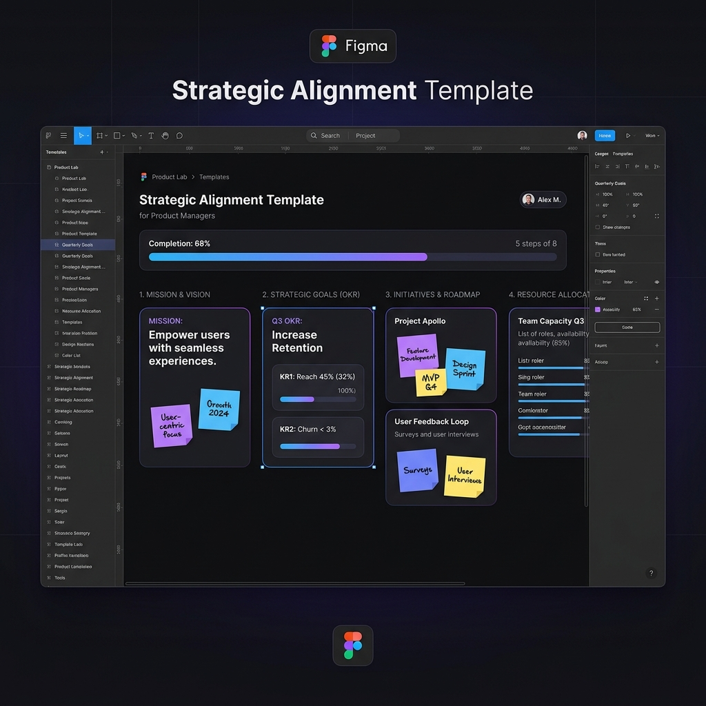

# 🚀 The PM Playbook

<div align="center">
  
  <br><br>
  <i>A interface definitiva para o desenvolvimento e rotina de Product Managers de Alta Performance.</i>
</div>

---

## 🎯 Visão do Produto
O **PM Playbook** não é apenas uma documentação, é uma **Plataforma Educacional e Ferramental** focada em resolver a maior dor de quem trabalha com produtos digitais: *a ponte entre a teoria e a execução prática*. 

Projetado com uma interface *Dark Mode* imersiva e moderna, o Playbook transforma metodologias complexas de Product Management em frameworks acionáveis e dinâmicos, guiando o PM do nível iniciante ao executivo.

---

## 💎 Proposta de Valor
Para um Product Manager, tempo e clareza são os recursos mais escassos. A plataforma centraliza os três pilares essenciais da disciplina:
1. **Conhecimento Estruturado:** Como conduzir Concepção, Execução e Lançamento de maneira eficaz.
2. **Avaliação de Maturidade:** Feedback em tempo real (Arena do PM) para identificar gaps de habilidade.
3. **Execução Imediata:** Templates estruturais exportáveis a um clique (Imagem, Excel, Word) para evitar a síndrome da página em branco.

---

## ✨ Funcionalidades Core (Features)

### 🔄 O Ciclo de Vida do Produto
Uma jornada visual e interativa por todas as 10 fases vitais de um produto. Desde a raiz do *Product Discovery* até o *Go To Market* e *Analytics*.

### ⚔️ Arena do PM (Quiz Gamificado)
Sistema de avaliação interativo projetado para estressar o conhecimento prático. Fornece diagnóstico imediato do nível de senioridade e áreas de melhoria baseadas na visão de produto.

### 🌌 Diagrama Orbital de Competências
Dashboard de visualização interativa das áreas essenciais para um PM: *Negócios, UX, Tecnologia, Dados, Liderança e Processos*.

### 📚 Biblioteca de Templates (Downloads Dinâmicos)
A "cereja do bolo" da plataforma. Ferramentas exportáveis prontas para uso no mundo real:
- **Alinhamento Estratégico:** Para garantir que o problema não seja uma "solução disfarçada".
- **Product Discovery:** Mapeamento de hipóteses e oportunidades com rigor analítico.
- **Delivery / Execução:** O modelo enxuto para negociar escopo e gerenciar riscos na Sprint.
- **Acompanhamento de Métricas:** Estruturação da *North Star Metric* e KPIs que fogem de métricas de vaidade.
- **Status Executivo:** O pragmatismo para comunicação em alto nível com a Liderança (C-Level).

*👉 Todos os modelos contam com um **"Modo Mentor"** embutido, indicando como um PM Sênior agiria naquele cenário, além de checklists de maturidade e alertas de erros comuns.*

---

## 🛠 Arquitetura & Stack Tecnológico
Para garantir a máxima performance, o projeto foi construído utilizando tecnologias nativas, resultando em carregamento instantâneo e código limpo:

- **HTML5 Semântico:** Estruturação impecável para SEO e acessibilidade.
- **CSS3 (Vanilla):** Sistema de Design robusto com variáveis globais (Design Tokens), flexibilidade nativa, efeito *Glassmorphism* e animações de alta fluidez.
- **JavaScript (ES6):** Manipulação de DOM para o Quiz, navegação suave e lógicas de geração de arquivos *Client-side* (exportação de XLS, DOC e PNG na própria máquina do usuário).
- **Lucide Icons:** Iconografia vetorial moderna.
- **html2canvas:** Motor para geração de snapshots em alta resolução dos frameworks.

---

## 🚀 Como Executar

Por ser um projeto *Client-Side* otimizado, não há necessidade de configurar servidores ou bancos de dados.

1. Clone o repositório em sua máquina:
```bash
git clone https://github.com/SEU-USUARIO/nome-do-repositorio.git
```
2. Abra a pasta baixada.
3. Dê um duplo clique no arquivo `index.html`.
4. *Pronto!* O Playbook abrirá perfeitamente no seu navegador.

---

## 🤝 Filosofia do Projeto
> "Produto bom não nasce de achismo. Nasce de problema bem entendido, decisão bem priorizada, execução bem alinhada e aprendizado contínuo."

Criado com dedicação para elevar o padrão da comunidade de Produto. Se você tem ideias para novos templates, frameworks ou refinamentos, sinta-se à vontade para abrir uma *Issue* ou enviar um *Pull Request*.

<div align="center">
  <br>
  <b>Feito com estratégia, dados e foco no usuário.</b>
</div>
